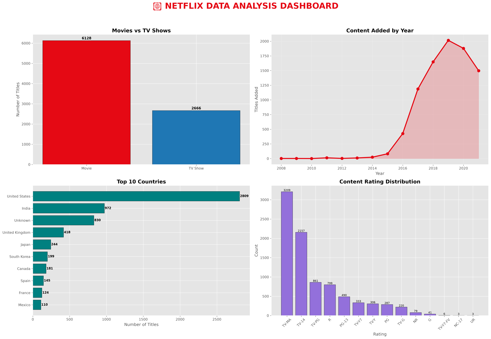

# 🎬 Netflix Data Cleaning & Visualization Project

## 📌 Project Overview

This project analyzes the Netflix Movies and TV Shows dataset using Python. The dataset was cleaned, processed, visualized, and transformed into meaningful insights through Exploratory Data Analysis (EDA).

The project demonstrates practical data cleaning techniques and professional data visualization skills using the Python data analysis ecosystem.

---

## 🎯 Objectives

- Clean raw Netflix dataset
- Handle missing values
- Remove duplicate records
- Convert incorrect data types
- Perform Exploratory Data Analysis (EDA)
- Create professional visualizations
- Build a dashboard summarizing important insights

---

## 🛠 Technologies Used

- Python
- Pandas
- NumPy
- Matplotlib
- Seaborn
- Jupyter Notebook
- Visual Studio Code

---

## 📂 Project Structure

```
Netflix-Data-Cleaning-Visualization/
│
├── data/
│   ├── netflix_titles.csv
│   └── cleaned_netflix_titles.csv
│
├── images/
│   └── dashboard.png
│
├── notebooks/
│   └── Netflix_Data_Cleaning.ipynb
│
├── report/
│   └── report.pdf
│
├── requirements.txt
└── README.md
```

---

## 📊 Visualizations

The project includes:

- Movies vs TV Shows
- Content Added by Year
- Release Year Distribution
- Top 10 Countries
- Top Ratings
- Top Genres
- Duration Distribution
- Monthly Content Trend
- Professional Dashboard
- KPI Summary

---

## 📈 Key Insights

- Movies significantly outnumber TV Shows.
- Netflix experienced rapid content growth between 2017 and 2020.
- The United States contributes the largest share of Netflix content.
- TV-MA is the most common content rating.
- Drama and International Movies are among the most popular genres.

---

## 📸 Dashboard Preview



---

## 🚀 How to Run

```bash
git clone https://github.com/SnehilChandra17/Netflix-Data-Cleaning-Visualization.git

cd Netflix-Data-Cleaning-Visualization

pip install -r requirements.txt

jupyter notebook
```

---

## 👨‍💻 Author

**Snehil Chandra**

GitHub:
https://github.com/SnehilChandra17

